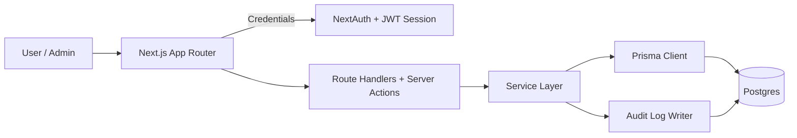

# Tenant Guard

Tenant Guard is a multi-tenant task management MVP with strict RBAC, invite flows, and an append-only audit trail. It is designed to be simple, correct, and portfolio-friendly while still enforcing tenant isolation and sensitive action logging.

## Features (scope-mapped)
- Auth: email/password sign up, sign in, and log out.
- Organizations + invites: create orgs, invite by email or link, accept invites.
- RBAC: Admin / Manager / Member enforced in the service layer.
- Tasks: CRUD with pagination + filters (status, assignee, search, date range, due date support).
- Audit log: sensitive actions are recorded with metadata.
- Tests + CI: service-layer tests and GitHub Actions checks.

## Tech stack
- Next.js App Router
- NextAuth (credentials + JWT)
- Prisma + Postgres
- Tailwind CSS v4
- Vitest

## Local setup
1. Install dependencies:
   ```bash
   npm install
   ```
2. Create a `.env` from the example:
   ```bash
   cp .env.example .env
   ```
3. Set environment variables:
   - `DATABASE_URL`
   - `NEXTAUTH_SECRET`
   - `NEXTAUTH_URL`
   - `NEXT_PUBLIC_APP_URL`
   - Optional demo seed: `DEMO_EMAIL`, `DEMO_PASSWORD`, `DEMO_ORG_NAME`
4. Push the Prisma schema:
   ```bash
   npx prisma db push
   ```
5. Run the dev server:
   ```bash
   npm run dev
   ```

## RBAC matrix (MVP)
| Action | Admin | Manager | Member |
| --- | --- | --- | --- |
| View tasks | ✅ | ✅ | ✅ |
| Create task | ✅ | ✅ | ✅ |
| Update any task | ✅ | ✅ | ❌ (only own / assigned) |
| Delete task | ✅ | ✅ | ❌ |
| Invite members | ✅ | ✅ | ❌ |
| Change roles | ✅ | ❌ | ❌ |
| View audit log | ✅ | ✅ | ❌ |

Notes:
- "Own" tasks are those created by the member (`createdByUserId`) or currently assigned to them.

## API overview
- `POST /api/auth/register` - Create user.
- `POST /api/auth/[...nextauth]` - Sign in/out (NextAuth).
- `GET/POST /api/orgs` - List or create orgs.
- `GET /api/orgs/:orgId` - Org details.
- `GET /api/orgs/:orgId/members` - List members (Admin/Manager).
- `PATCH /api/orgs/:orgId/members/:userId` - Change role (Admin).
- `GET/POST /api/orgs/:orgId/invitations` - List or create invites (Admin/Manager).
- `POST /api/orgs/:orgId/invitations/:inviteId/revoke` - Revoke invite (Admin/Manager).
- `POST /api/invitations/accept` - Accept invite (logged-in user).
- `GET/POST /api/orgs/:orgId/tasks` - List or create tasks.
- `GET /api/orgs/:orgId/tasks?page=1&limit=20&status=OPEN&assignee=me&search=foo&from=2026-01-01&to=2026-02-01&dateField=dueDate` - Filter/paginate tasks.
- `GET /api/orgs/:orgId/tasks/:taskId` - Task details.
- `PATCH/DELETE /api/orgs/:orgId/tasks/:taskId` - Update or delete tasks.
- `GET /api/orgs/:orgId/audit?cursor=...&limit=50` - Audit log (Admin/Manager).

## Testing + CI
- Local tests reset the database, so point `DATABASE_URL` at a dedicated test DB.
- `npm test` runs `npx prisma db push --force-reset` then `vitest run`.
- GitHub Actions on every PR runs: `npm ci`, `npm run lint`, `npx prisma validate`, `npm test`.

## Deployment notes
1. Provision Neon Postgres (or Supabase Postgres) and copy `DATABASE_URL`.
2. Deploy to Vercel.
3. Set environment variables:
   - `DATABASE_URL`
   - `NEXTAUTH_SECRET` (and any provider client IDs/secrets if using OAuth)
   - `NEXTAUTH_URL`
   - `NEXT_PUBLIC_APP_URL`
4. Run migrations on deploy:
   - Recommended: `npx prisma migrate deploy`
   - MVP alternative: `npx prisma db push`
5. Optional demo seed: `npm run seed:demo`

## Architecture diagram

Source file: `docs/architecture.mmd`

## Data model (conceptual)
- User: `id`, `email`, `passwordHash`, `createdAt`.
- Organization: `id`, `name`, `createdById`, `createdAt`.
- Membership: `orgId`, `userId`, `role` (ADMIN/MANAGER/MEMBER), `createdAt`.
- Invitation: `orgId`, `email`, `role`, `tokenHash`, `expiresAt`, `invitedByUserId`, `acceptedAt`, `revokedAt`.
- Task: `orgId`, `title`, `description`, `status`, `priority`, `assignedToUserId`, `dueDate`, `createdByUserId`, `timestamps`.
- AuditLog: `orgId`, `actorUserId`, `action`, `entityType`, `entityId`, `metadata` (JSON), `ip`, `userAgent`, `createdAt`.

Notes:
- All org-owned tables include `orgId` and are scoped per tenant.
- Invite tokens are stored as hashes (`tokenHash`).
- Audit logs are append-only and not editable from the UI.
