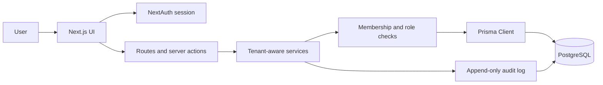

# Tenant Guard

Security-focused multi-tenant SaaS application built with Next.js, TypeScript, PostgreSQL,
Prisma, and NextAuth. Tenant Guard demonstrates organization isolation, role-based access
control, invite-based onboarding, and append-only audit logging in a practical task-management
workflow.

> **Project status:** portfolio MVP for local development and controlled pilots. Production
> readiness still requires the operational work tracked in
> [`docs/product/roadmap.md`](docs/product/roadmap.md).

## Why this project exists

One application serves many organizations, but every read and write must remain inside the
current user's tenant boundary. Tenant Guard keeps those authorization decisions in a
tenant-aware service layer instead of scattering them through UI components and route handlers.

## Core capabilities

- Email/password authentication with JWT sessions
- Organizations and memberships with `ADMIN`, `MANAGER`, and `MEMBER` roles
- Hashed, expiring, revocable invitation tokens
- Task creation, filtering, pagination, assignment, status, priority, and due dates
- Tenant-scoped service-layer authorization
- Append-only audit events for sensitive actions
- PostgreSQL persistence through Prisma and checked-in migrations
- Unit and database-backed service tests with GitHub Actions CI

## Architecture


```mermaid
flowchart LR
  User[User] --> UI[Next.js UI]
  UI --> Auth[NextAuth session]
  UI --> Routes[Routes and server actions]
  Routes --> Services[Tenant-aware services]
  Services --> RBAC[Membership and role checks]
  RBAC --> Prisma[Prisma Client]
  Prisma --> Postgres[(PostgreSQL)]
  Services --> Audit[Append-only audit log]
  Audit --> Postgres
```

```text
src/app/                 Pages and API route handlers
src/components/          Reusable UI components
src/services/            Tenant-aware application services
src/server/              Auth, database, RBAC, logging, and domain services
prisma/                  Schema and checked-in migrations
scripts/                 Test, seed, and backup utilities
docs/                    Product, architecture, security, and operations guides
```

See [`docs/architecture/tenancy-and-rbac.md`](docs/architecture/tenancy-and-rbac.md) before
changing authorization behavior.

## Authorization model

| Capability | Admin | Manager | Member |
| --- | ---: | ---: | ---: |
| View and create tasks | Yes | Yes | Yes |
| Update any task | Yes | Yes | No |
| Update own or assigned task | Yes | Yes | Yes |
| Delete tasks | Yes | Yes | No |
| View members | Yes | Yes | No |
| Create invitations | Yes | Yes | No |
| Invite managers | Yes | Yes | No |
| Invite administrators | Yes | No | No |
| Change member roles | Yes | No | No |
| Read audit events | Yes | Yes | No |

## Tech stack

Next.js App Router · React · TypeScript · NextAuth · Prisma · PostgreSQL · Tailwind CSS · Vitest · Resend

## Run locally

Prerequisites: Node.js 20+, npm, and PostgreSQL 14+.

```bash
npm install
cp .env.example .env
npx prisma migrate dev
npm run dev
```

Open [http://localhost:3000](http://localhost:3000). Set a random `NEXTAUTH_SECRET` and local
database URLs in `.env`. Use `prisma migrate dev`, not `prisma db push`, so the local schema
matches the checked-in migration history.

### Demo data

Set `DEMO_EMAIL`, `DEMO_PASSWORD`, and `DEMO_ORG_NAME` in `.env`, then run:

```bash
npm run seed:demo
```

The seed script refuses the default demo password unless `ALLOW_DEMO_SEED=true` is explicitly
set. Never use demo credentials in a shared or production environment.

## Testing

Create `.env.test` from the example and point it only at a disposable test database:

```bash
cp .env.test.example .env.test
npm test
```

The runner refuses to reset a database whose URL does not look like a test database unless
`ALLOW_UNSAFE_TEST_DB=true` is set. Do not use that override against shared or production data.

| Command | Purpose |
| --- | --- |
| `npm run dev` | Start the development server |
| `npm run lint` | Run ESLint |
| `npm run build` | Create a production build |
| `npm test` | Reset the test database and run Vitest |
| `npm run test:unit` | Run Vitest without resetting the database |
| `npx prisma validate` | Validate the Prisma schema |
| `npm run db:backup` | Create a local database backup |

## Deployment boundary

Use `npx prisma migrate deploy` for staging and production. Keep local, test, preview, staging,
and production databases and secrets separate. Before onboarding external users, complete the
monitoring, backup, recovery, and security work in
[`docs/operations/deployment.md`](docs/operations/deployment.md) and the
[`product roadmap`](docs/product/roadmap.md).

## Documentation

The root README is intentionally brief. Detailed engineering material lives under [`docs`](docs/README.md):

- [`Architecture`](docs/architecture/system-design.md)
- [`Data model`](docs/architecture/data-model.md)
- [`Tenancy and RBAC`](docs/architecture/tenancy-and-rbac.md)
- [`Threat model`](docs/security/threat-model.md)
- [`Deployment`](docs/operations/deployment.md)
- [`Product roadmap`](docs/product/roadmap.md)

See [`CONTRIBUTING.md`](CONTRIBUTING.md) for the development checklist and [`SECURITY.md`](SECURITY.md)
for private vulnerability reporting.

## License

Licensed under the [MIT License](LICENSE).
