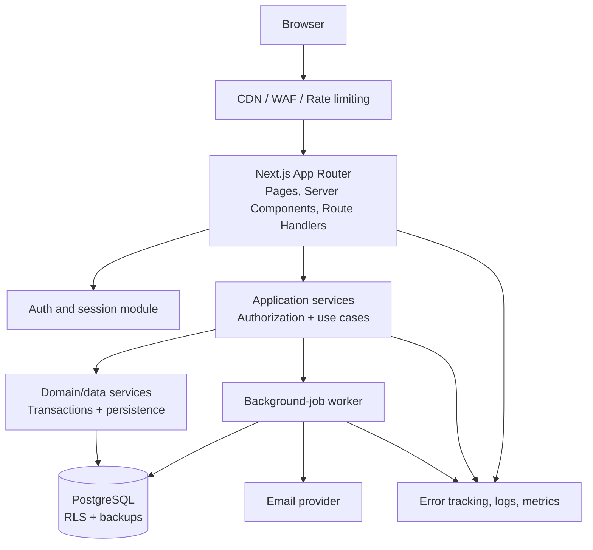
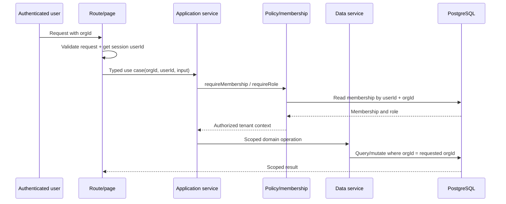
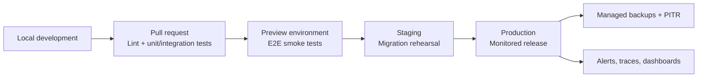

# Tenant Guard — Architecture Guide

This guide defines the intended architecture for the existing application and the rules that keep it safe as it grows.

## 1. Architecture at a glance

Tenant Guard should remain a **modular monolith**: one Next.js deployment, one PostgreSQL system of record, and clearly separated modules. This has the lowest operational burden while providing strong boundaries for a multi-tenant product.

## 2. Module boundaries

| Module | Owns | Must not do |
| --- | --- | --- |
| `src/app` | Page composition, HTTP parsing, response mapping, redirects | Implement business authorization or issue unscoped Prisma queries. |
| `src/components` | Reusable presentation and client interaction | Contain secret-bearing server logic or make authorization decisions. |
| `src/services` | Use cases: membership checks, policy enforcement, orchestration | Depend on request objects or browser state. |
| `src/server/services` | Database operations, transactions, audit/outbox writes | Trust an unvalidated external input or bypass tenant scope. |
| `src/server` | Prisma, auth, sessions, errors, policy helpers, telemetry | Become a catch-all for unrelated product logic. |
| `prisma` | Schema and reviewed migrations | Be changed directly in production without a migration process. |
| future `src/jobs` | Retriable asynchronous work | Make authorization decisions from missing/ambiguous tenant context. |

## 3. Tenant-isolation contract

Every tenant-owned model must have `orgId`, an index beginning with `orgId`, and a corresponding relationship to `Organization`. Examples include Tasks, Invitations, Audit Logs, Comments, Attachments, Notification Preferences, and API Keys.

Every request that uses tenant-owned data follows this sequence:

Rules:

1. Never accept `userId`, role, or `orgId` as authoritative from a browser body; get the actor from the session and obtain role from the database.
2. A record lookup by ID must also include `orgId`. Use `findFirst({ where: { id, orgId } })`, a compound unique key, or RLS—not `findUnique({ where: { id } })` alone for tenant-owned data.
3. List, count, update, delete, relation loading, exports, and background jobs must all use tenant scope.
4. Add a test proving that a member of organization A cannot read or mutate the same resource ID through organization B.
5. Treat `AsyncLocalStorage` tenant context as helpful diagnostics only until it is backed by enforced middleware/RLS.

### Database defense in depth

The preferred mature design combines service authorization with PostgreSQL row-level security. Each transaction sets a trusted organization setting (for example `app.current_org_id`) after membership authorization; policies restrict `SELECT`, `INSERT`, `UPDATE`, and `DELETE` to that setting. Use a narrowly privileged database role for the web app. Migrations/admin jobs may require a separate role and additional care.

Before enabling RLS broadly, prove the design with integration tests and ensure Prisma connection-pooling semantics preserve transaction-local settings. If that operational cost is too high initially, keep strict service scoping and test enforcement, then schedule RLS as a security milestone.

## 4. Authorization model

| Capability | Admin | Manager | Member |
| --- | --- | --- | --- |
| Read organization tasks | Yes | Yes | Yes |
| Create tasks | Yes | Yes | Yes |
| Update any task | Yes | Yes | No |
| Update own/assigned task | Yes | Yes | Yes |
| Delete tasks | Yes | Yes | No |
| View members/audit | Yes | Yes | No |
| Invite members/managers | Yes | Yes | No |
| Invite admins/change roles | Yes | No | No |

Implement this in a policy module or domain service, not separately in the UI and every route. UI capability checks are for usability; service checks are the security enforcement.

Required invariants:

- An organization always has at least one `ADMIN`.
- An assignee must be an active member of the same organization.
- A membership removed from an organization loses access immediately.
- Invite acceptance is atomic: one valid invite creates/reuses one membership and marks the invite accepted.
- Admin-level actions and high-impact changes produce an audit event.

## 5. Data design and transactions

Current core entities are appropriate: `User`, `Organization`, `Membership`, `Invitation`, `Task`, and `AuditLog`.

Recommended additions when the use case arrives:

| Entity | Purpose | Important constraints |
| --- | --- | --- |
| `TaskComment` | Discussion on work items | `orgId`, `taskId`, author ID; membership/tenant scoped. |
| `TaskActivity` | User-visible history | May be derived from audit events initially; avoid duplicate sources of truth. |
| `Attachment` | File metadata | Store bytes in object storage; DB contains tenant-owned metadata and signed-access policy. |
| `OutboxEvent` | Reliable delivery of external effects | Written in the same transaction as state change, consumed idempotently. |
| `IdempotencyKey` | Safe retry of create/mutation requests | Unique by org, actor, key, and request scope. |

For a sensitive mutation, use a short transaction:

1. Read and validate the scoped record and policy.
2. Apply the state change.
3. Write an audit event and, when external work follows, an outbox event.
4. Commit; a worker later delivers email/webhook effects with retries.

Do not hold transactions open while calling an email provider, analytics API, or file service.

## 6. API conventions

- Authentication failures return `401`; authenticated but disallowed actions return `403`; scoped missing records return `404`.
- Validate inputs with Zod at the HTTP boundary. Centralize schemas when a server action and API endpoint share a contract.
- Use predictable envelopes and error codes, for example `{ data }` for success and `{ error: { code, message } }` for failure.
- Paginate collections; use cursor pagination for audit/activity feeds and other fast-growing tables.
- Use ISO 8601 timestamps in UTC. Convert only at the UI boundary.
- Add idempotency keys to externally retryable POST endpoints such as invite creation and task creation.
- Document every endpoint with authorization, input, output, side effects, and audit behavior.

## 7. Background processing

Use jobs for invitation email, notification fan-out, reminders, audit exports, cleanup of expired invites, and integration/webhook delivery.

Each job must carry `orgId`, a stable event/resource ID, an idempotency key, attempt count, and structured error metadata. Workers must re-check that referenced resources remain valid and tenant-scoped; queue payloads are not a substitute for authorization/data validation.

## 8. Deployment and operations

Use separate environment configuration and databases for local, test, staging, and production. Never run tests against production. Use Prisma migrations in source control and prefer expand/contract migrations for breaking schema changes:

1. Add backward-compatible schema.
2. Deploy code that writes both shapes or reads the new shape safely.
3. Backfill through a monitored job.
4. Switch reads.
5. Remove old fields only after the old application version is gone.

Operational minimums: managed database backups with point-in-time recovery, tested restore runbook, error alerts, uptime checks, performance traces, secret rotation procedure, dependency updates, and a documented incident response owner.

## 9. Quality strategy

| Test type | Purpose | Minimum examples |
| --- | --- | --- |
| Unit | Pure policy and validation rules | Role matrix, last-admin invariant, input validation. |
| Integration | Database and service behavior | Cross-tenant access blocked, audit/outbox written transactionally, invite races. |
| E2E | Critical browser journeys | Sign up, create org, invite/accept, member denial, manager task operation. |
| Security | Abuse and configuration checks | Rate limits, no sensitive logs, dependency scan, authorization matrix regression. |
| Performance | Validate growth assumptions | Concurrent task list, audit cursor feed, large-tenant filtering. |

Every bug that crosses a module boundary should gain a regression test at the most direct layer, plus an E2E test when a real user flow was affected.

## 10. Architecture review checklist

Before merging a feature, answer:

- What organization owns this data, and where is tenant scope enforced?
- Who can read, create, change, and delete it? Is the policy tested?
- What happens with a stale session, duplicate retry, race, or deleted member?
- Does the change need a transaction, audit event, outbox event, or migration?
- How will the feature be observed, rolled out, and rolled back?
- Are privacy, retention, accessibility, and performance impacts understood?

If any answer is unclear, the feature design is not ready to implement.
