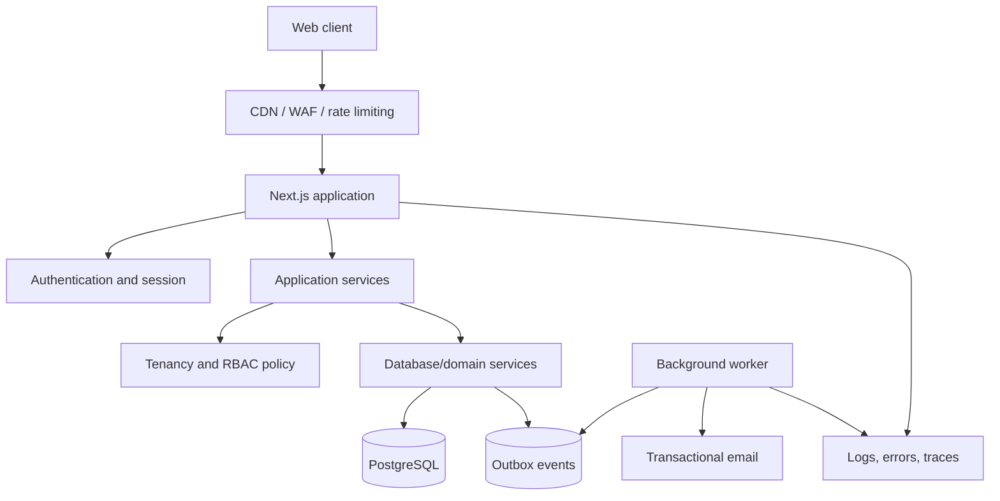

# System Design

**Status:** Accepted target architecture

## Context

Tenant Guard is a multi-tenant web application for organization-scoped task coordination. It must prioritize data isolation, predictable authorization, auditability, and low operational complexity.

## Architecture

Use a modular monolith: one Next.js application, one PostgreSQL system of record, and asynchronous workers only for operations that should not run in an HTTP request.

## Request lifecycle

1. Route handler or server action validates input and reads the authenticated user ID from the session.
2. Application service receives `{ orgId, userId, payload }`.
3. Membership and role policy is loaded from PostgreSQL.
4. A database/domain service performs an explicitly organization-scoped query.
5. Sensitive mutations and audit/outbox records commit atomically where applicable.
6. HTTP layer maps typed errors to consistent status codes and safe messages.

## Dependency rules

| Layer | May depend on | Must not depend on |
| --- | --- | --- |
| `src/components` | UI types, browser-safe utilities | Prisma, secrets, server sessions |
| `src/app` | components, application services, validation, session | Direct unscoped database operations, embedded business policy |
| `src/services` | policy, server/domain services, typed errors | Request/Response objects or client state |
| `src/server/services` | Prisma, domain types, transactions, audit writer | Browser modules or unvalidated external data |
| `src/jobs` (future) | server/domain services, queue contracts | Trusting queue payloads as authorization proof |

## Scaling strategy

- Scale the stateless web application horizontally.
- Scale PostgreSQL vertically first and optimize measured slow queries.
- Add Redis only for rate limits, short-lived coordination, or measured hot-cache needs.
- Use PostgreSQL search initially; introduce dedicated search only after relevance or scale requires it.
- Extract a service only when it needs independent deployment, security isolation, ownership, or materially different scaling.

## Failure strategy

- External effects use queued jobs with retries and idempotency.
- Mutations return success only after the authoritative database transaction commits.
- Timeouts and provider failures must not leave invitations/tasks in ambiguous states.
- Every request receives a correlation ID; jobs propagate organization, event, and correlation IDs.

## Architecture fitness checks

- CI proves cross-tenant denial for every tenant-owned resource.
- Dependency rules can later be enforced through ESLint import boundaries.
- Slow-query and error dashboards identify regressions by release.
- Migration rehearsals prove backwards compatibility for rolling deployments.
