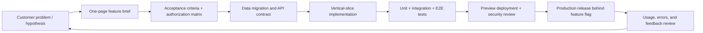

# Tenant Guard — Product, Delivery, and Business Blueprint

**Status:** recommended plan for evolving the existing MVP into a dependable small-team B2B SaaS product.  
**Scope:** a multi-tenant workspace for task coordination, with organization isolation, role-based access, invitations, and accountability logs.

## 1. Executive summary

Tenant Guard already has the right foundation for its intended product: a Next.js application backed by PostgreSQL, with organization-scoped records, three membership roles, invitation-based onboarding, and audit events. The next goal should not be to add every project-management feature. It should be to make the tenancy and operational foundations production-grade, validate the target customer, and then grow a focused workflow around reliable task execution.

The recommended market position is **a lightweight, secure task workspace for small operational teams that need clear organizational boundaries and accountability without the overhead of enterprise project-management software**. This is a strong fit for agencies, property/tenant operations, IT service teams, internal business operations, and client-facing teams.

The product should be delivered in three deliberate phases:

1. **Production-readiness:** protect tenant boundaries, improve authentication and operations, add observability and deployment controls.
2. **Usable core workflow:** improve task lifecycle, collaboration, notification, and membership administration.
3. **Validated expansion:** add integrations, reporting, enterprise controls, or vertical-specific workflows only after customer evidence supports them.

## 2. Current-state assessment

### What already exists

| Capability | Current implementation | Assessment |
| --- | --- | --- |
| Tenant boundary | `Organization` owns memberships, invitations, tasks, and audit logs | Correct baseline model; every future tenant-owned table must include `orgId`. |
| Access control | `ADMIN`, `MANAGER`, and `MEMBER` roles, with service-layer authorization | Good separation from route handlers; retain this pattern. |
| Authentication | Email/password using NextAuth credentials and JWT sessions | Suitable for MVP; needs hardening and additional sign-in options before broad release. |
| Invites | Hashed tokens, expiry, revocation, and acceptance | Strong starting point; email delivery and abuse controls are missing. |
| Tasks | CRUD, assignment, priority, status, filtering, pagination | Covers basic work management; lacks comments, history UI, attachments, and notifications. |
| Auditing | Append-only `AuditLog` events for sensitive actions | Valuable differentiator; needs tamper-resistance policy, retention, and search/export decisions. |
| Quality | Unit/service tests, linting, Prisma validation, pull-request CI | Good MVP safety net; add integration, end-to-end, security, and migration tests. |

### Important observations

- Tenant protection is currently an **application-layer convention**, principally via `requireMembership` and `orgId` query filters. That is reasonable for the MVP, but an accidental unscoped query could still expose data. Production use should add database-level defense in depth.
- The app uses `AsyncLocalStorage` to record organization context, but this context is not visibly enforced by Prisma middleware or PostgreSQL row-level security. Treat it as diagnostic context, not a security boundary, until enforcement is implemented.
- Routes validate inputs with Zod and services centralize authorization. New features must never bypass those services with direct Prisma calls from route handlers or React Server Components.
- The repository has uncommitted work. This blueprint is additive only and does not assume those changes are complete or correct.

## 3. How the application should be developed

### Development principles

1. **Tenant safety precedes features.** A new feature is incomplete until its read paths, write paths, exports, jobs, logs, and tests are all organization-scoped.
2. **Build vertical slices.** Deliver a small user outcome end-to-end (UI, API/service, database, audit, tests) instead of creating disconnected layers.
3. **Keep policy near the domain.** Routes parse HTTP and obtain identity; application services authorize; domain/data services persist. This current separation should be preserved.
4. **Use progressive hardening.** Maintain a simple modular monolith while usage is small; add queues, caches, and service boundaries only when measured needs justify them.
5. **Make irreversible actions explicit.** Deletion, role demotion, membership removal, exports, and data retention actions need confirmation, audit events, and predictable recovery rules.

### Recommended delivery workflow

For each feature, require this definition of done:

- A user story, success metric, and non-goals are written first.
- Every tenant-owned query filters by `orgId`; authorization is checked before data is returned or mutated.
- Input, response, and error behavior are defined with a versioned or documented contract.
- Sensitive mutations write an audit event in the same transaction where practical.
- Tests cover an authorized actor, an unauthorized member, and a user from a different organization.
- Monitoring, rollout, and rollback expectations are specified.

### Phased product roadmap

| Phase | Outcome | Key work | Exit signal |
| --- | --- | --- | --- |
| 0. Foundation (2–4 weeks) | Safe deployable baseline | Production environments, migrations, backups, error tracking, rate limits, auth hardening, CI gates | A staging-to-production release can be monitored and rolled back safely. |
| 1. Core workflow (4–8 weeks) | Teams complete daily work inside Tenant Guard | Task editing UI, comments/activity, due-date views, member removal, email invites, notifications, audit-log UI | 3–5 pilot teams use it weekly without manual support for core flows. |
| 2. Retention (6–10 weeks) | Managers can run work consistently | Saved views, reporting, notification preferences, bulk actions, data export, onboarding | Pilot activation and weekly retention meet targets set in the PRD. |
| 3. Expansion | Revenue/segment-led growth | SSO, SCIM, APIs/webhooks, integrations, custom roles, vertical workflows | Repeated customer demand and willingness to pay justify each investment. |

## 4. Recommended technology stack

### Keep now

| Layer | Recommendation | Why |
| --- | --- | --- |
| Web application | Next.js App Router + React + TypeScript | Already present; supports server-rendered pages, API routes, and a single cohesive deployment. |
| Data access | Prisma + PostgreSQL | Strong type safety and migrations; PostgreSQL is the appropriate transactional system of record. |
| Validation | Zod | Already used and appropriate for boundary validation and shared contracts. |
| Authentication | Keep Auth.js/NextAuth for the MVP; plan a migration path to current Auth.js patterns | Existing implementation works; evaluate hosted auth only if social login, organization SSO, or identity operations become a product bottleneck. |
| Tests | Vitest for unit/integration tests | Retain the fast service-level suite. |
| Styling | Tailwind CSS | Good fit for the current UI and a small product team. |

### Add for a production release

| Concern | Recommendation | Rationale |
| --- | --- | --- |
| Hosting | Vercel or a container host such as Fly.io/Render, with separate preview, staging, and production environments | Choose Vercel for lowest Next.js operational burden; choose container hosting when network/database control is primary. |
| Database hosting | Managed PostgreSQL with point-in-time recovery | Prevents the database from becoming a self-managed operational risk. |
| Database security | PostgreSQL row-level security (RLS) for tenant-owned tables where operationally feasible | A second, database-enforced barrier against cross-tenant reads/writes. |
| Background work | A managed queue or workflow runner (e.g., Inngest, Trigger.dev, or Cloud Tasks) | Handles email, reminders, audit export, cleanup, and retries outside HTTP requests. |
| Email | Transactional provider such as Resend or Postmark | Delivers invites, reset emails, reminders, and delivery telemetry. |
| Cache/rate limits | Redis-compatible managed service only for rate limits, idempotency, and hot reads | Do not add it prematurely as a primary data store. |
| Observability | Sentry for errors/performance; structured JSON logs; product analytics such as PostHog | Enables fast incident response and evidence-based product decisions. |
| E2E testing | Playwright | Tests the important browser paths: sign-up, invite acceptance, authorization, and tenant isolation. |
| Security automation | Dependabot/Renovate, secret scanning, dependency scanning, and automated backups | Low-effort controls with high risk reduction. |

### What not to introduce yet

- Microservices, Kubernetes, event sourcing, a separate GraphQL gateway, or Elasticsearch are unnecessary at MVP scale.
- Do not use a generic "permissions" table until the three roles demonstrably block product needs. A compact policy module and clear tests are easier to reason about.
- Avoid a separate mobile app until the web workflow has evidence of regular mobile use; build responsive web and optionally a PWA first.

## 5. Technical challenges and mitigation plan

| Priority | Challenge | Why it matters | Recommended mitigation |
| --- | --- | --- | --- |
| P0 | Cross-tenant data leakage | This is the highest-severity failure mode in a multi-tenant product. | Enforce `orgId` in services, add cross-tenant tests for every resource, consider RLS, and build code review checks for tenant-scoped models. |
| P0 | Authorization drift | New endpoints can accidentally use a different role rule from the UI or other APIs. | Create a single policy module per domain, publish an RBAC matrix, and test policy decisions directly. |
| P0 | Authentication abuse | Password login invites credential stuffing, registration abuse, weak recovery, and session risks. | Rate-limit login/register/invite acceptance; use secure cookies and rotation; add email verification and password reset; later offer OAuth/SSO based on demand. |
| P0 | Consistency of data + audit records | A successful mutation without its audit event weakens accountability. | Use short database transactions for the mutation plus audit write; use a transactional outbox for external effects. |
| P1 | Invite lifecycle | Tokens may be leaked, reused, accepted twice, or accepted by the wrong account. | Preserve hashing/expiry; make acceptance transactional and idempotent; support email-bound invite rules; rate-limit attempts; notify sender/recipient. |
| P1 | Role and ownership edge cases | Demoting/removing the last admin can orphan a tenant; task assignments can target non-members. | Enforce at least one admin; prevent assignment to non-members; define transfer/archival rules. |
| P1 | Database growth and query cost | Task search and audit history get expensive as tenants grow. | Continue composite indexes; use cursor pagination for large feeds; add PostgreSQL full-text search or a purpose-built search service only after measurement. |
| P1 | Background job reliability | Email and reminders need retries without duplicate delivery. | Queue jobs with idempotency keys, retry policy, dead-letter handling, and delivery events. |
| P1 | Safe schema evolution | Production migrations can lock tables or break rolling deploys. | Use reviewed Prisma migrations, expand/contract changes, migration smoke tests, backups, and a rollback plan. |
| P2 | Compliance and privacy | Audit logs can accumulate personal data and need retention discipline. | Data map, minimize stored data, define retention/deletion policy, encrypt in transit/at rest, and offer export/deletion workflows as needed. |
| P2 | Accessibility and UX quality | Operations products are used frequently; poor interaction design harms retention. | Keyboard navigation, semantic UI, contrast checks, loading/empty/error states, and Playwright accessibility checks. |

## 6. Business documents required before a public launch

### 6.1 Product requirements document (PRD)

**Problem:** Small teams need a simple shared task workspace with clear organization boundaries, controlled access, and an accountable history of sensitive actions.

**Primary users:**

| Persona | Job to be done | Desired outcome |
| --- | --- | --- |
| Workspace admin | Set up a secure workspace and control access | A team is onboarded correctly without accidental exposure. |
| Team manager | Coordinate assignments and follow-up | Work has owners, deadlines, and visible progress. |
| Team member | See and complete assigned work | Daily work is clear and easy to update. |
| Business owner / compliance reviewer | Understand sensitive changes | Important actions can be reconstructed later. |

**MVP success metrics (set numeric targets before launch):**

- Activation: organization creator creates an organization, invites a teammate, and creates a task within the first session.
- Collaboration: percentage of activated organizations with two or more active members in the first seven days.
- Retention: weekly active organizations after four weeks.
- Reliability: successful request rate, p95 response time, and zero confirmed cross-tenant incidents.
- Trust: invitation-delivery success and support requests related to access/permissions.

**Core acceptance criteria:** An authenticated user can only access their own organizations; a member cannot manage memberships or delete tasks; an admin can manage membership safely; invite acceptance is expiry/revocation/email aware; and sensitive actions appear in the audit trail.

**Explicit non-goals for the first release:** full project planning, time tracking, chat, a native app, custom workflows, and complex billing.

### 6.2 Non-functional requirements (NFRs)

| Area | Launch requirement |
| --- | --- |
| Security | Tenant isolation tests for every tenant-owned endpoint; least-privilege access; secrets only in managed environment configuration. |
| Availability | Define target (for example, 99.9% monthly) and a maintenance/incident communication process. |
| Performance | Establish p95 targets for primary reads/writes and load-test the task list/audit feed before launch. |
| Recovery | Automated backups, point-in-time recovery, documented restore test at least quarterly. |
| Observability | Error alerts, uptime monitoring, traceable request IDs, and audit events for sensitive state changes. |
| Privacy | Privacy policy, data inventory, retention schedule, deletion/export process, and approved subprocessors. |
| Accessibility | Meet WCAG 2.1 AA for core workflows. |

### 6.3 Security and privacy checklist

- Threat-model the auth, invitation, organization switching, task access, export, and admin flows.
- Record data categories, processors, retention periods, and legal basis before collecting new personal data.
- Use HTTPS everywhere; hash passwords with an adaptive password hash; never log tokens, passwords, or raw sensitive form bodies.
- Set rate limits on registration, credentials login, password reset, invitations, and public invite-token routes.
- Require a verified email or an equivalent policy before allowing high-trust actions.
- Establish incident severity, escalation owner, customer notification, and post-incident review templates.
- Publish Terms of Service, Privacy Policy, and an acceptable-use policy before customer onboarding.

### 6.4 Go-to-market and operating assumptions

Start with a narrow, reachable segment rather than marketing to all teams. Interview 10–15 target users about their existing task workflow, their access-control pain, and the moment they need an audit trail. Recruit 3–5 design partners willing to use the product weekly. Charge only after they achieve a repeatable outcome; early pricing should be simple (for example, a per-workspace or per-seat tier) and should not require a complex billing system.

Operating ownership should be explicit even for a solo project: product decisions, on-call/incident response, customer support, security/release approval, and data access administration each need a named owner. Keep a lightweight decision log and release notes.

## 7. Decision register

| Decision | Recommendation | Revisit when |
| --- | --- | --- |
| Application shape | Modular monolith | Independent deployment/scaling needs are measured, not anticipated. |
| Authorization | Role policy in services + database defense in depth | Customers need granular/custom permissions. |
| Search | PostgreSQL first | Search relevance or corpus size materially degrades. |
| Notifications | Background jobs with email first | Users request real-time collaboration or other channels. |
| Authentication | Credentials plus verification/recovery, then OAuth/SSO based on demand | Conversion or enterprise requirements show the need. |
| Billing | Manual/design-partner billing initially | Pricing and paid conversion are validated. |

## 8. Immediate next actions

1. Turn the P0/P1 items into a backlog and choose the first pilot segment.
2. Add a staging environment, managed PostgreSQL backups, Sentry, structured logging, and rate limits.
3. Add Playwright coverage for cross-tenant access, member authorization, invite acceptance, and admin role changes.
4. Decide and implement a last-admin and membership-removal policy before inviting external users.
5. Use the companion architecture guide for all new module, API, migration, and deployment decisions.
