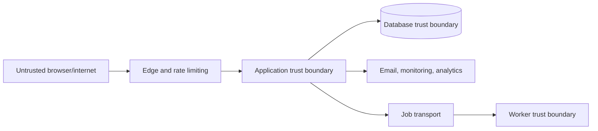

# Threat Model

**Status:** Proposed for review before private pilot

## Protected assets

- Organization membership and role assignments
- Tenant-owned tasks and audit history
- User identity, password hashes, and sessions
- Invitation grants and email addresses
- Production database, backups, secrets, and provider credentials
- Availability and integrity of the service

## Trust boundaries

All browser inputs, route parameters, headers, queue payloads, provider callbacks, and imported data are untrusted. A valid session proves identity, not organization authorization.

## Priority threats

| ID | Threat | Impact | Required controls |
| --- | --- | --- | --- |
| T-01 | Cross-tenant record access using guessed IDs | Critical confidentiality/integrity breach | Membership check, `{ id, orgId }` queries, cross-tenant tests, later RLS evaluation |
| T-02 | Role escalation through request payload or stale claims | Critical privilege gain | Load role from membership DB row; never trust client role; audit role changes |
| T-03 | Credential stuffing and account enumeration | Account takeover | Rate limits, neutral errors, password policy, monitoring, optional breached-password check |
| T-04 | Invite token theft/replay/race | Unauthorized membership | Strong random token, hash at rest, expiry, email binding, transactional one-time acceptance |
| T-05 | Last-admin removal or malicious membership changes | Tenant lockout | Transactional invariant, confirmation, audit, recovery procedure |
| T-06 | Assignment to a user outside the organization | Metadata leak/integrity failure | Same-organization active membership validation |
| T-07 | CSRF/session misuse on mutations | Unauthorized changes | Secure same-site cookies, framework CSRF protections, origin validation where applicable |
| T-08 | XSS through titles/descriptions/audit metadata | Session/data compromise | React escaping, no unsafe HTML, CSP, safe rendering and length limits |
| T-09 | Sensitive data in logs/analytics/audit metadata | Privacy/credential leak | Structured allowlisted fields, redaction, access control, retention |
| T-10 | Dependency or secret compromise | Full service compromise | Least privilege, managed secrets, rotation, scanning, patch process |
| T-11 | Email/job duplication or forgery | Confusing or unauthorized side effects | Outbox, idempotency, signed callbacks, retry/dead-letter policy |
| T-12 | Database deletion/corruption | Availability and permanent data loss | PITR, tested restoration, restricted roles, migration safeguards |

## Abuse controls

Rate-limit registration, login, password reset, invite lookup/acceptance, invite creation, and high-cost search/export routes by appropriate combinations of IP, user, organization, and endpoint. Limits should return a neutral response and emit metrics without logging secrets.

## Security verification

- Test the full RBAC matrix and cross-tenant variants in CI.
- Test duplicate and concurrent invitation acceptance.
- Scan dependencies and repository history for secrets.
- Verify production cookie, CSP, HTTPS, and security-header configuration.
- Review provider permissions and webhook validation.
- Perform a focused external security review before accepting sensitive customer data.

## Residual risks

Application-only tenancy remains vulnerable to a newly introduced unscoped query. Until RLS or equivalent enforcement is deployed, mitigation depends on service boundaries, code review, and comprehensive integration tests.
